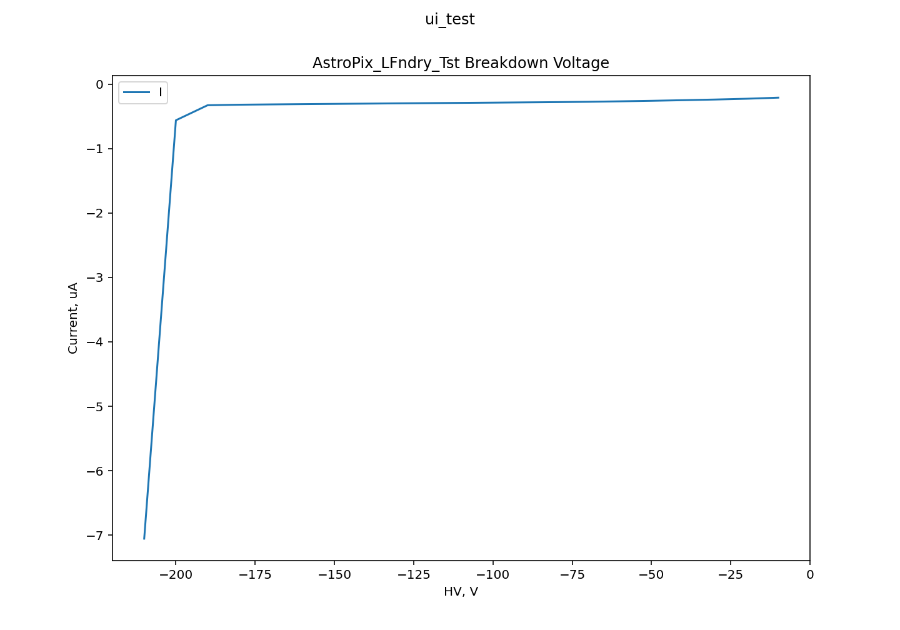

    

This super repository shares all necessary steps and procedures including the required software in order to make various analogue measurements with the Astropix-LFoundry-Testchip.

The measurements conducted so far are:

1. Analog Ampout measurements via Tektronix MDO3024 oscilloscope
2. I-V Curve of the -HV photodiode with an 2470 Keithley SMU
3. Analog Hitbus signal measurement after the Astropix comparator

### Repository structure

So far the Astropix_LFndry_Test repository contains 3 different sub repositories.

1. The astropix-firmware fork contains the HDL design for the Nexus Video FPGA to interact with the Testchip (Unit under Test) via a USB computer interface

2. The astropix-python-LFndry-Test fork supplies python scripts to configure the hardware registers of the Testchip / UUT as well as setting other input parameters  

3. Finally the Measurements_TestScriptProcessor contains TSP and Python
scripts to execute I-V measurements with the 2470 SMU used to generate a 
HV signal

More Detailed description about the installation procedure and about the single repository is available inside the repositories README file

## SETUP AND EXAMPLE USAGE

In this section all necessary steps are detailed in order to begin with an Astropix-LFoundry-Testchip measurement.

First of all the requirements until this step here are listed.

1. AstPx_LFndry_Tst PCB is needed with a bonded Astropix-LFoundry-Testchip
2. Further a Nexus Video FPGA Testboard and a connected  GECCO PCB including an injection card for Ampout/Hitbus measurements
3. Power Supply with 3 distinct sources for the Gecco PCB to generate Testchip voltages
4. SMU to generate the HV Signal 
5. SMA connector cables for analog oscilloscope measurement and to connect the SMU with the PCB

### Setup

#### I-V Curve Measurement

The actual setup up for the I-V curve measurement is much simpler.

Only the 2470 SMU and the Testpcb with the bonded chip is required.

So far the SMU 2470 has been controlled via a LAN connection. With that an easy control for sweeps is possible via the provided python script in the Measurements_TestScriptProcessor repository.

For now sadly the current IPv4 address needs to be manually read from the SMU device Menu 
--> Press the MENU button and then read it from Communication->LAN

1. To begin the measurements only connect the -HV potential from the SMU to the SMA connector on the testpcb and then power up the SMU.

2. The provided script RES_SVMI_TSP.py for the I-V Curve measurement first sweeps the voltage between 0V and -200V in steps of 10V. Afterwards the respective measured current at that point is stored inside a .csv file.

3. Finally a basic I-V curve can be plotted from the .csv file with the plot_ui.py script.

Further the LF_TST_PREC_BREAKDOWN_SVMI_TSP.py performs a more narrow analysis around the actualy fully depleted diode operation region.
(-196/-205V in steps of 0.1V).

#### Register configuration for Ampout/Hitbus measurements

The Astropix Lfoundry Testchip possesses a configuration register for different analog current sources and internal voltages.

This configuration register can be set from a .yaml file inside the config folder of the astropix-python-LFndry-Test repository.

An overview of this register topology is given below together with a short description.

##### Column Control Configuration Register

| Config Register | no. Bit | Description |
| --- | --- | --- |
| `EnInj` | 1 Bit     | Set this Bit to '1' enable the Injection Signal input for the entire column  |
| `RamWr` | 5 Bit     | **4 bit** as write signals lines for the Comparator TrimDAC, **1 bit** write signal line for the enable signal of the comparator  |
| `Amp` | 1 Bit       | Set to '1' to multiplex the amplifier output of **one single** pixel to the chip physical Ampout Port for analog measurements|
| `Inj` | 1 Bit       |Enable the injection signal for a specific pixel |
| `RamIn` | 1 Bit     | Bitline for the internal RAM containing 1 Bit of data either '0' or '1' |
| `EnB_HBRec` | 1 Bit | Inverted Enable Signal for the Hitbus Signal Output |

The described configuration registers exist for each of the 3 pixels on chip 

##### Bias Block Configuration Register

| Config Register | no. Bit | Description |
| --- | --- | --- |
| `idac 15`     | 6 Bit       |  |
| `idac 14`     | 6 Bit       |  |
| `idac 13`     | 6 Bit       | pfoll Bias of Amput Source Follower |
| `idac 12`     | 6 Bit       | phb Pull up current source for Hitbus |
| `idac 8`      | 6 Bit       | pdac trimDAC maximum tuning strom per Pixel |
| `idac 11`     | 6 Bit       | nbias  weak Current N-well 1.8V pull up: important **Tn-wellBias < Tamp**! |
| `idac 10`     | 6 Bit       |  |
| `VNBiasComp`  | 6 Bit       | Bias Strom Comparator |
| `VN`          | 6 Bit       | Bias current Amplifier --> Look at Razavi Amplification formula|
| `idac6`       | 6 Bit       | VNFB Feedback current --> comes with a Feedbackcapacity for the circuit |
| `idac 7`      | 6 Bit       | BLRes --> Highpass output filtering, high value means weak filtering and vice versa, takes influes of time of threshold (TOT) of Hitbus signal |
| `VNSF`        | 6 Bit       | Source Follower Amp as sub of Amplifier, changes to low Rout + DC Level Shifting of Inj Transistor inside Amplifier |
| `idac 3`      | 6 Bit       | VPload doesn't increase Amplification but has influence on Bandwidth |
| `idac 2`      | 6 Bit       |  |
| `VNBiasRec2`  | 1 Bit       |  |
| `VNBiasRec`   | 1 Bit       |  |

##### Vdac Configuration Register

| Config Register | no. Bit | Description |
| --- | --- | --- |
| `BL`      |  8 Bit       | Set the Voltage for the HP filtering output of the amplifier |
| `Vth`     |  8 Bit       | Set the comparator threshold voltage |
| `Vcasc`   |  8 Bit       | Set the voltage for the cascode inside the amplifier |

#### Ampout and Hitbus measurements

First of all the generated bitfile for the FPGA hardwaredesign has to be installed via the PROG. USB micro port. This can be executed via Vivado directly in the GUI mode via the Hardware Manager 

Click on open target and afterwards on Program device and select the correct bitstream file for the measurement setup.

Afterwards we can start the Power Supply and supply the Gecco PCB with 

1. Voltage: 2.7V for VDD3.3
2. Voltage: 1.8V for POW4 which represents the VDD voltage for the Testchip
3. Voltage: 0V for POW6 which sets the ground potential for Vminus Port of the Testchip

After that the 2470 SMU can be connected directly to the SMA -HV port on the TestPCB here the -HV Potential is flexible between 0V and ~ -200V

Finally for measurement purposes an oscilloscope can be connected as well to the SMA Ampout respective Hitbus Ports on the TestPCB

These are analog signal outputs directly connected to the LFoundry_Testchip outputs.

Now its time to start the python main script from the astropix-pyhton-Lfndry-Test repository together with a YAML config
file for the internal chip configuration register.

Inside the main.py script the YAML configuration file is then uploaded to the Lfoundry-Testchip. 

Further the main.py creates an injection signal as a testsignal instead of an radiation source which would generated real gamma photons to detect.

This injection signal can be configured from the main.py signal accordingly. It is thus flexible in amplitude, frequency etc.

## Results

### Ampout and Hitbus Measurements

### I-V Curve Measurements

With an increasing negative potential the depletion region of the reversed biased photosensor diode increases as well until it becomes fully depleted at around -200V

    

